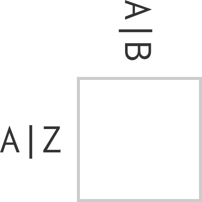
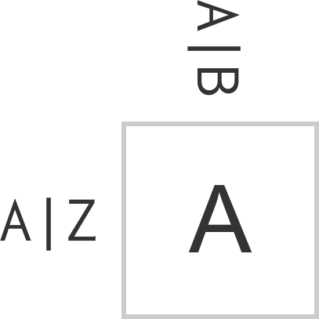
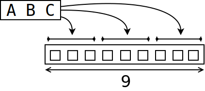
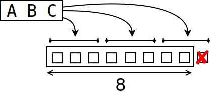
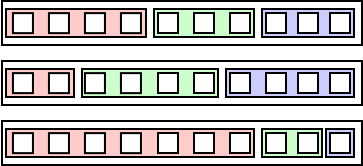

# Hello!

##


##


##


# Solving regex crosswords

## Regex Crossword

https://regexcrossword.com

@omichelsen, @mhmichelsen

##



##



## ​


## Completionist

## Responsibilities

# `Clo[js]ure`

## Crossword?

* more like Sudoku
* backtracking
* `core.logic`!

## core.logic

```clojure
(let [vars (repeatedly 81 lvar)
      rows (->> vars (partition 9) (map vec) (into []))
      cols (apply map vector rows)
      sqs ...]
  (run 1 [q]
    (== q vars)
    (everyg #(fd/in % (fd/interval 1 9)) vars)
    (everyg fd/distinct rows)
    (everyg fd/distinct cols)
    (everyg fd/distinct sqs)))
```

(Go watch anything by Will Byrd)

## test.chuck regex parser

```clojure
(cre/parse "CLO[JS]URE")
{:type :alternation,
 :elements
 ({:type :concatenation,
   :elements
   ({:type :character, :character \C} ...
    {:type :class,
     :elements
     [{:type :class-intersection,
       :elements
       ({:type :class-union,
         :elements ({:type :class-base, :chars #{\J}} ...)})}],
     :brackets? true}
    {:type :character, :character \U} ...)})}
```

## `A`

<div style="font-size: 180%">
```clojure
(defmethod re->goal :character
  [{:keys [character]} [lvar]]
  (l/== character lvar))
```
</div>

## `A|B`

<div style="font-size: 180%">
```clojure
(defmethod re->goal :alternation
  [{:keys [elements]} lvars]
  (l/or*
    (map #(re->goal % lvars)
      elements)))
```
</div>

## `A{x,y}`, `A*`, ...

```clojure
(defmethod re->goal :repetition
  [{[elem] :elements [lower upper] :bounds} lvars]
  (let [n-vars (count lvars)
        lower (-> lower (or 0))
        upper (-> upper (or n-vars) (max n-vars))]
    (if (zero? n-vars)
      (if (zero? lower) l/succeed l/fail)
      (l/or*
       (for [reps (range (max lower 1) (inc upper))
             :when (zero? (rem n-vars reps))
             :let [group-size (quot n-vars reps)
                   groups (partition group-size lvars)]]
         (l/and* (map (partial re->goal elem) groups)))))))
```

##



##



## Concatenation

<div style="font-size: 500%">
```
A B C
↓ ↓ ↓
☐ ☐ ☐
```
</div>

## `A*B*C*`?



## `A*B*C*`

<div style="font-size: 200%">
```clojure
(->> [a b c] (apply +) (== 9))

[[0 0 9] [0 1 8] [0 2 7] ...]
```
</div>

## Hmm

If only...

## `core.logic.fd`!

<div style="font-size: 180%">
```clojure
(defn reduceo ...)
(def sumo (partial reduceo fd/+))
;; (sumo 9 [a b c])
```
</div>

## Logic all the way down!

<div style="font-size: 600%; margin-top: -60px">
🐢<sub>🐢<sub>🐢<sub>🐢<sub>...</sub></sub></sub></sub>
</div>

## 💥 core.logic 💥

If it's not working,<br>you're not using enough of it

# Conclusion

## Django

<style>
@import url('https://fonts.googleapis.com/css?family=Just+Another+Hand&display=swap');
@import url('https://fonts.googleapis.com/css?family=Amatic+SC:700&display=swap');
@import url('https://fonts.googleapis.com/css?family=Permanent+Marker&display=swap');


.replacement {
  position: relative;
}

.replacement p {
  margin-top: 30px;
}

.replacement span {
  position: absolute;
  font-family: 'Permanent Marker', cursive;
}

.replacement span.above {
  top: -30px;
}

.replacement span.below {
  bottom: -30px;
}
</style>

<div class="replacement">
"The web framework for<br>
perfectionists with deadlines."
</div>

## `core.logic`

<div class="replacement">
"The <span class="above" style="margin-left: 30px">?</span><s>web</s> <span class="above" style="margin-left: 30px">library</span><s>framework</s> for<br><span class="below" style="margin-left: -30px">completionists</span><s>perfectionists</s> with <span class="below" style="margin-left: -30px">responsibilities</span><s>deadlines</s>."
</div>

## World domination

`(webservero request response)`

## Blog post

`lvh.io`
